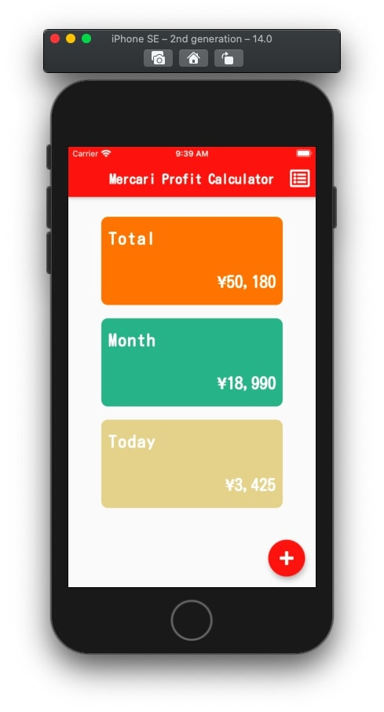
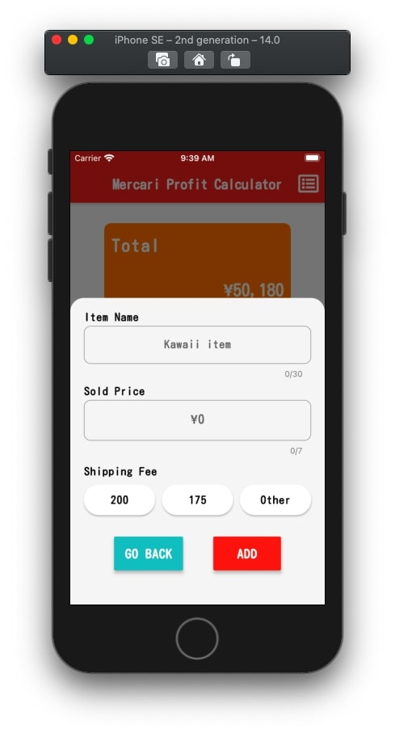
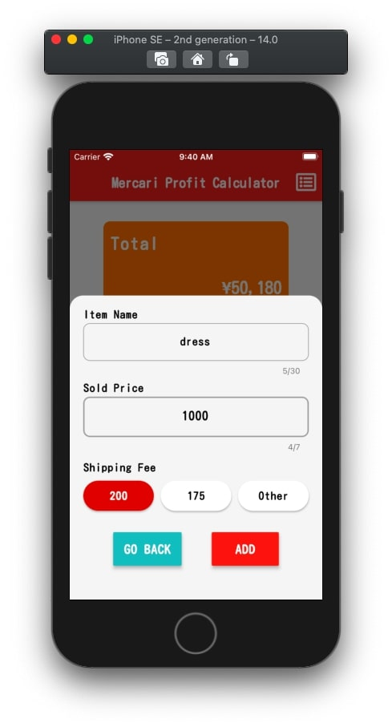
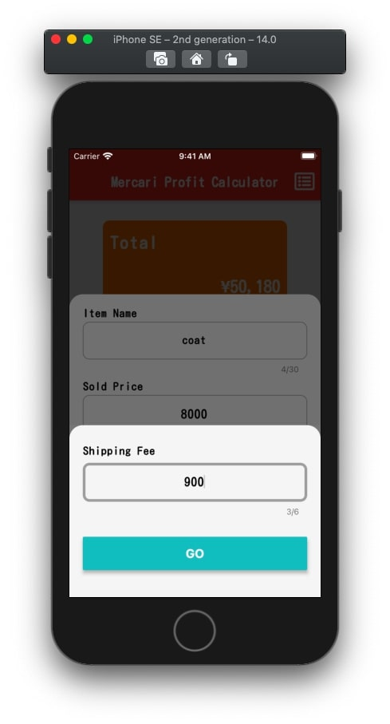
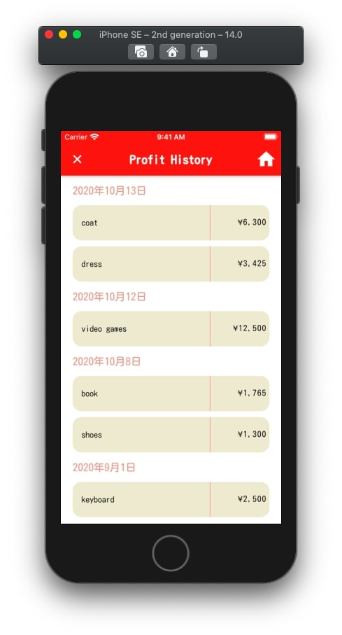
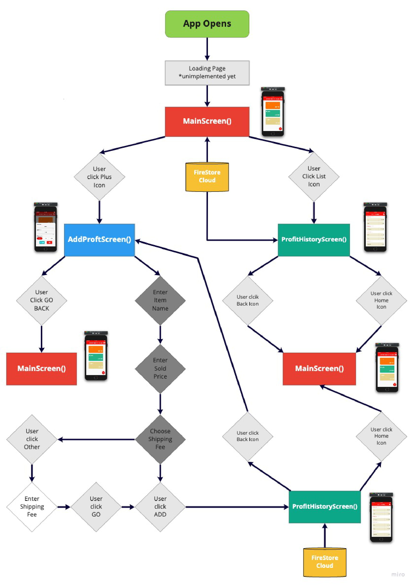

# mercari_profit_calculator

This is my very first Flutter App. This idea was inspired by my wife, who loves Mercari: 
one of the most famous Flea market apps in Japan.

This app is connected with Google Cloud Database. Therefore, you can always get latest update from database within a second.

## Presentation video

Please visit this Youtube link:
[Presentation](https://www.youtube.com/watch?v=pC3CcviVKew)

## Example

## Flow Chart

